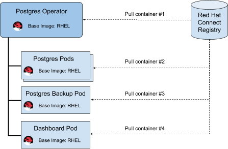

# Base Images

Red Hat is serious about security for Operators and using a Red Hat supported base image is required for inclusion in the OpenShift OperatorHub. RHEL and OpenShift have many security certifications, which require RHEL usage throughout the entire stack for compatibility. As a partner you have access to licenses for OpenShift and RHEL for testing.

Before 2019, redistributing a RHEL base image was not allowed. A new RHEL “Universal Base Image \(UBI\)” is available with relaxed restrictions, to allow you to use any CI tool to build your Operator and store your Operator images within any registry.

Community Operators may use any base image, but it is highly suggested to use the RHEL universal base image for the best security.

In order for your operator to be Red Hat certified \(described below\), the Operator and all of its associated images, must use a RHEL based image \(UBI or otherwise\) and be distributed from the Red Hat partner registry. This ensures that Red Hat \(and you by extension\) can comply with legal export compliance. Below is an example of an Operator that uses 4 total images:

Each of the 4 containers shown above must also remain published and accessible forever, so that OpenShift clusters can continue to start these workloads as Kubernetes moves them around the cluster.

